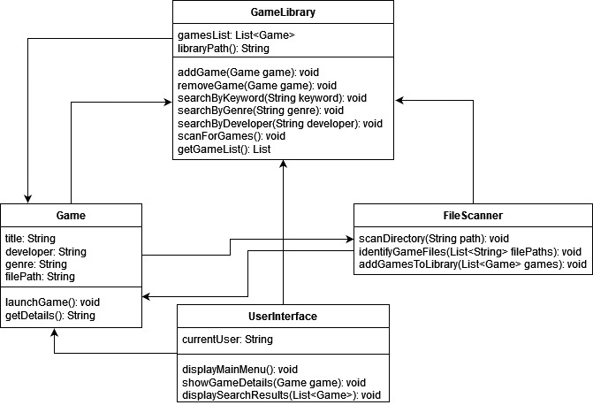

# Table Of Contents
- [Description](#ctrllibrary)
- [CRC Cards & Class Diagram](#crc-cards--class-diagram)
- [Wireframe GUI Layout](#wireframe-gui-layout)
- [Requirements Traceability Matrix](#requirements-traceability-matrix)

# CtrlLibrary
Effortlessly manage, categorize, and explore your personal video game collection right from your desktop. With advanced organization features, CtrlLibrary simplifies the search process, enabling users to quickly find titles based on keyword, genre, or developer. It will even scan a given folder recurssively to automatically add your games to the list.

## CRC Cards & Class Diagram

## Wireframe GUI Layout

## Requirements Traceability Matrix
